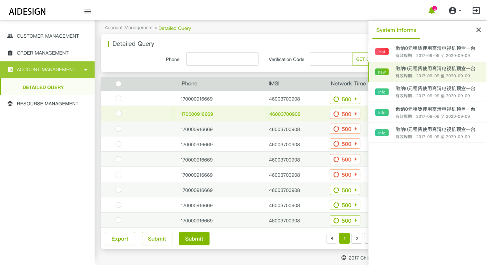

# aid-layout
> vue component for crm system, aid-layout for layout


#### Install
> npm install aid-layout --save || npm install aid-layout@xx --save

#### Useage

- aid-layout component install (Vue plugin inject)

```js
/**
 * 需要将frame组件注册到Vue中
 */
/* 全局注册 */
import Vue from 'vue'
import { TFrame, locals } from 'vue-frame-crm'
Vue.use(TFame)

/* 局部注册， */
import { TFrame } from 'vue-frame-crm'
export default {
    ...
    components: {
        TFrame
    },
    ...
}

/* 注册插件内国家化 */
const i18n = new VueI18n({
    messages: {
        'en-US': {
            ...locals.US
        },
        'zh-CN': {
            ...locals.CN
        }
    }
})
```

- using in template

```html
<!-- 在模版中使用 -->
<t-frame
    :img="img"
    :imgMin="imgMin"
    :logo-router="logoRouter"
    :authorization="authorization"
    :navs="navs"
    :instance="$cmi">
</t-frame>
```

- parameters in frame component

> - img [String] 左上角的logo的url
> - imgMin [String] 左上角的logo缩略状态下的 url
> - logoRouter [Object] 左上角的logo的点击状态下的路由
> - activeMenu [String, Number] 左侧菜单需要选中的menu
> - openNames [Array] 左侧菜单需要打开的menu
> - menuList [Array] 菜单数据，菜单数据结构如下：
    menuIcon, 一级菜单的右侧icon的type，对应的是aidesign的图标库
    menuId, menu 的id,
    menuPid, menu 的父节点的id
    menuName, menu 的name,
    menuUrl, menu 的节点,
    rightTag, 用于规定当前域的标签,
    systemUrl, 如果是多域情况下的host
> - navs [Array] 右上角的导航，导航结构如下：
>   type, 'icon'| 'dropdown' | 'avatar' 导航种类
    icon, 图标icon的type，对应的是aidesign的图标库类型
    children, 如果是dropdown时需要提供dropdownitem，形式跟 dropdown 的形式一样， 结构如下：
    icon, 左侧的图标
    name, dropitem的名字
> - instance [Object] 服务调用的实例，axios的实例
> - authorization [Object] 菜单获取与语言选择的接口Url
> - tag [String] 当前项目的标签，对应成多域状态，单域情况下不需要设置
> - logoutCb [Function] 退出登录的回调
> - tokenTimeout [Function] token失效（401）下，插件内服务调用的回调
> - prefixRoute [Array] 用于自动展开左侧menu菜单的设置，过滤掉相关的前缀

#### Example
```js
import img from '../../assets/images/cmi-img/cmi-logo.png'
import imgMin from '../../assets/images/cmi-img/logo-min.png'
import authorization from '../../authorization.js'
/**
* authorization.js *
export default {
  menuUri: '/mock/getStaffMenue', // 获取左侧导航的接口
  logout_uri: '/mock/logout', // 退出登录地址
  bulletinListUri: '/mock/getBulletinList', // 获取右侧消息列表的接口
  bulletinByIdUri: '/mock/getBulletinById', // 获取消息详情的接口
  langUri: '/mock/getLoginLanguage', // 获取登录页面中设置的语言
  changeLangUri: '/mock/setVueLanguage' // 保存修改语言
}
 */
export default {
    data () {
        return {
            img: img,
            imgMin: imgMin,
            logoRouter: { name: 'Index'},
            /**
             *  菜单数据可以直接传给menuList，或者有插件内调用接口数据，后者需要设置authorization.js
             */
            menuList: [{
                'menuId': 2003,
                'menuName': '资源查询',
                'menuPid': 20,
                'menuUrl': '/res/cmi-Resource-information',
                'rightTag': 'CMI',
                'systemUrl': ''
              },
              {
                'menuId': 2001,
                'menuName': '实物入库',
                'menuPid': 20,
                'menuUrl': '/res/cmi-storage-new',
                'rightTag': 'CMI',
                'systemUrl': ''
              },
              {
                'menuId': 1003,
                'menuName': '流量报表',
                'menuPid': 21,
                'menuUrl': '/rpt/cmi-data-summary',
                'rightTag': 'CMI',
                'systemUrl': ''
              },
              {
                'menuId': 17,
                'menuName': '客户管理',
                'menuPid': -1,
                'rightTag': 'CMI',
                'systemUrl': '',
                'menuIcon': 'people'
              },
              {
                'menuId': 2004,
                'menuName': '库存量查询',
                'menuPid': 20,
                'menuUrl': '/res/cmi-storage-check',
                'rightTag': 'CMI',
                'systemUrl': ''
              },
              {
                'menuId': 2005,
                'menuName': '预配号卡绑定',
                'menuPid': 20,
                'menuUrl': '/res/cmi-Product-binding',
                'rightTag': 'CMI',
                'systemUrl': ''
              },
              {
                'menuId': 1002,
                'menuName': '语音报表',
                'menuPid': 21,
                'menuUrl': '/rpt/cmi-call-summary',
                'rightTag': 'CMI',
                'systemUrl': ''
              },
              {
                'menuId': 1009,
                'menuName': '充值卡状态报表',
                'menuPid': 21,
                'menuUrl': '/rpt/cmi-voucher-status',
                'rightTag': 'CMI',
                'systemUrl': ''
              },
              {
                'menuId': 1802,
                'menuName': '预配号卡批量开户',
                'menuPid': 18,
                'menuUrl': '/order/cmi-batch',
                'rightTag': 'CMI',
                'systemUrl': ''
              },
              {
                'menuId': 1801,
                'menuName': '订单查询',
                'menuPid': 18,
                'menuUrl': '/order/cmi-order',
                'rightTag': 'CMI',
                'systemUrl': ''
              },
              {
                'menuId': 1803,
                'menuName': '批量业务查询',
                'menuPid': 18,
                'menuUrl': '/order/cmi-inquery',
                'rightTag': 'CMI',
                'systemUrl': ''
              },
              {
                'menuId': 20,
                'menuName': '资源管理',
                'menuPid': -1,
                'rightTag': 'CMI',
                'systemUrl': '',
                'menuIcon': 'buffer'
              },
              {
                'menuId': 2002,
                'menuName': '入库结果查询',
                'menuPid': 20,
                'menuUrl': '/res/cmi-storage-info',
                'rightTag': 'CMI',
                'systemUrl': ''
              },
              {
                'menuId': 1004,
                'menuName': '短信报表',
                'menuPid': 21,
                'menuUrl': '/rpt/cmi-sms-summary',
                'rightTag': 'CMI',
                'systemUrl': ''
              },
              {
                'menuId': 1010,
                'menuName': '成本报表',
                'menuPid': 21,
                'menuUrl': '/rpt/cmi-total-cost',
                'rightTag': 'CMI',
                'systemUrl': ''
              },
              {
                'menuId': 1005,
                'menuName': '用户状态报表',
                'menuPid': 21,
                'menuUrl': '/rpt/cmi-subscriber-status',
                'rightTag': 'CMI',
                'systemUrl': ''
              },
              {
                'menuId': 1901,
                'menuName': '详单查询',
                'menuPid': 19,
                'menuUrl': '/acct/cmi-bill-manage',
                'rightTag': 'CMI',
                'systemUrl': ''
              },
              {
                'menuId': 1701,
                'menuName': '客户统一视图',
                'menuPid': 17,
                'menuUrl': '/cust/cmi-Customer-View',
                'rightTag': 'CMI',
                'systemUrl': ''
              },
              {
                'menuId': 1007,
                'menuName': '交易明细',
                'menuPid': 21,
                'menuUrl': '/rpt/cmi-transaction-detail',
                'rightTag': 'CMI',
                'systemUrl': ''
              },
              {
                'menuId': 2101,
                'menuName': '收入报表',
                'menuPid': 21,
                'menuUrl': '/rpt/cmi-income-summary',
                'rightTag': 'CMI',
                'systemUrl': ''
              },
              {
                'menuId': 19,
                'menuName': '账务管理',
                'menuPid': -1,
                'rightTag': 'CMI',
                'systemUrl': '',
                'menuIcon': 'wallet'
              },
              {
                'menuId': 21,
                'menuName': '报表管理',
                'menuPid': -1,
                'rightTag': 'CMI',
                'systemUrl': '',
                'menuIcon': 'table-large'
              },
              {
                'menuId': 1006,
                'menuName': '订购报表',
                'menuPid': 21,
                'menuUrl': '/rpt/cmi-subscription-report',
                'rightTag': 'CMI',
                'systemUrl': ''
              },
              {
                'menuId': 1008,
                'menuName': '交易报表',
                'menuPid': 21,
                'menuUrl': '/rpt/cmi-transaction',
                'rightTag': 'CMI',
                'systemUrl': ''
              },
              {
                'menuId': 1,
                'menuName': '主页',
                'menuPid': -1,
                'menuUrl': '/cust/',
                'rightTag': 'CMI',
                'systemUrl': '',
                'menuIcon': 'home'
              },
              {
                'menuId': 18,
                'menuName': '订单管理',
                'menuPid': -1,
                'rightTag': 'CMI',
                'systemUrl': '',
                'menuIcon': 'clipboard-text'
              }],
            logoutCb: () => {
                console.log('........ logout')
            },
            prefixRoute: ['/']
        }
    }
}

```